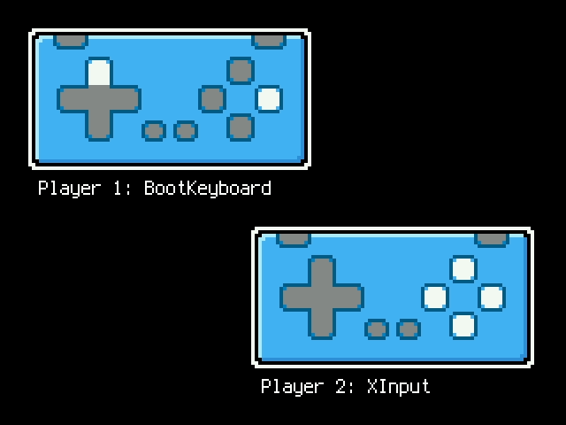

<!-- SPDX-License-Identifier: MIT -->
<!-- SPDX-FileCopyrightText: Copyright 2025 Sam Blenny -->
# Fruit Jam Two Gamepad Demo

This is my third iteration on CircuitPython USB host gamepad tester. This time
it does two game controllers with asyncio instead of just one. The code should
be more readable too. There's a boot keyboard to gamepad mapper. And, I devised
a janky-but-serviceable unplug detection heuristic that works reasonably well.

## Board and CircuitPython Version

I wrote and tested this on a Fruit Jam rev D (production) board with
CircuitPython version 10.0.0-beta.2.

## Credits

Thanks to @relic-se for suggestions and inspiration on potential improvements
to my previous Fruit Jam gamepad code.
